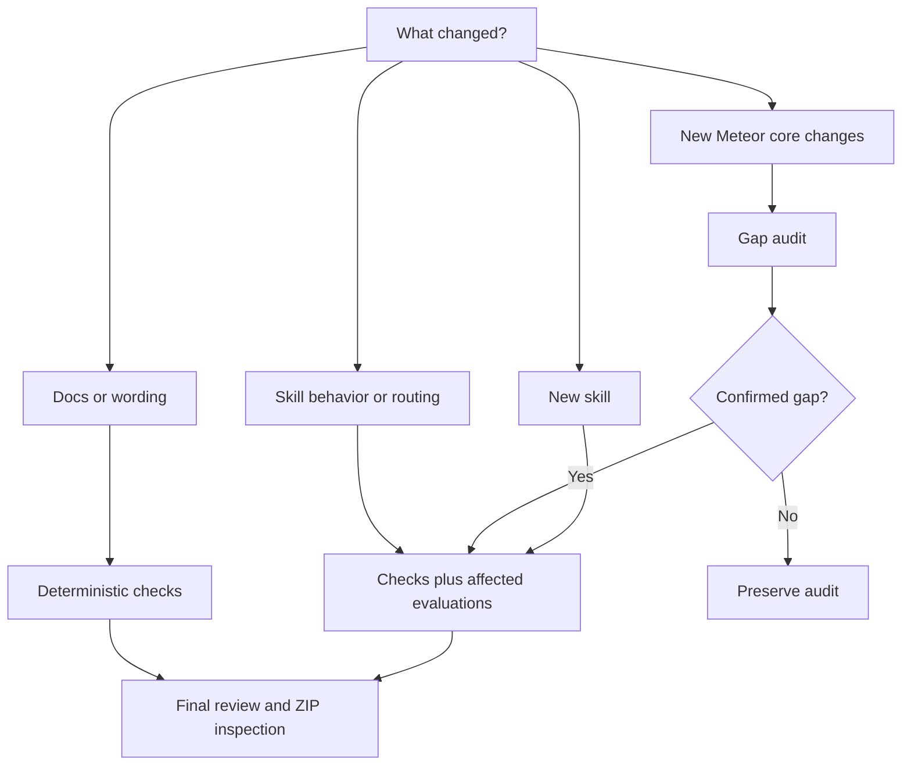
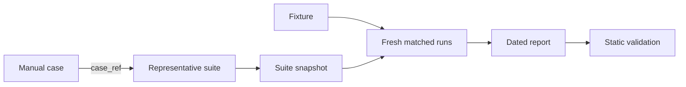

# Maintenance verification guide

Use this guide when you maintain a skill, audit Meteor changes, or prepare a
contribution. Choose a recipe, run its commands, or copy its prompt into an
agent working from the repository root.

For schemas, digests, and report invariants, use the
[evaluation contract](../.github/skills/skill-behavior-evaluation/references/evaluation-contract.md).

## Choose a recipe



### Documentation or wording only

Use this for spelling, formatting, repaired links, or a source refresh that
does not change an agent decision.

```bash
pnpm run validate
pnpm run check-links
pnpm run catalog:check
pnpm test
git diff --check
```

Prompt:

> Review this documentation-only change with `skill-maintenance`. Verify the
> source, links, metadata, and catalog. Do not run a model evaluation unless
> guidance or routing changed. Report the commands run and any limitation.

Build and inspect ZIPs when a published skill file changed.

### Skill behavior or routing

Use this for version boundaries, migration or security decisions, scaffolds,
descriptions, routing, or a previously observed behavioral failure.

```bash
pnpm run validate
pnpm run evaluation:snapshot-suite -- evaluations/skills/<skill>/cases.json
# Run the affected isolated model conditions.
pnpm run validate:evaluations
pnpm run build:zips
```

Prompt:

> Use `skill-behavior-evaluation` for `<skill>`. Run only affected
> representative cases in fresh workspaces. Compare `current-skill` with
> `without-skill`; add `previous-skill` only for a direct regression
> comparison. Grade observable outcomes and create a new snapshot and dated
> report without rewriting historical evidence.

One repetition supports a behavioral observation. Reliability, time, or token
claims require at least three repetitions for every compared condition.

### New Meteor core changes

Use an audit before editing published skills.

> Use `skill-gap-audit` to compare this catalog with the current
> `meteor/meteor` `devel` revision. Start from the latest applicable committed
> audit, prioritize `v3-docs`, verify introduction versions from history or
> package releases, and store a reproducible read-only audit. Do not modify
> published skills.

If a finding is confirmed and implementation is authorized:

> Use `skill-maintenance` to implement only confirmed findings from
> `<audit-path>`. Update the smallest coherent skill surface, bump independent
> skill versions, maintain affected cases, and run the verification level
> justified by the behavior change.

Preserve earlier audits. An audit is evidence, not permission to expand scope.

### New skill

Follow [`CONTRIBUTING.md`](../CONTRIBUTING.md) and start from
`skills/_template/`.

> Use `skill-maintenance` to create `<skill-name>` for `<user-outcome>`.
> Inspect neighboring skills and bundles, keep routing distinct, add canonical
> and representative cases, and use `skill-behavior-evaluation` to test
> selection and behavior. Do not create a skill if an existing one already
> owns the outcome.

Routing tests must cover the expected primary skill, allowed secondary skills,
forbidden neighbors, and the intended handoff.

### Final contribution review

Run the complete local sequence before opening or updating a PR:

```bash
pnpm install --frozen-lockfile
pnpm run validate
pnpm run check-links
pnpm run catalog:check
pnpm test
pnpm run build:zips
git diff --check
```

Prompt:

> Perform a final maintenance review of this branch. Check factual evidence,
> skill versions, routing and representative cases, current reports where
> required, catalog state, and changed ZIP contents. Run the full local check
> sequence. List blockers and limitations. Do not commit, tag, or push unless
> explicitly requested.

Changed ZIPs must contain only published runtime files. Maintainer skills,
audits, evaluations, reports, and raw work stay outside release archives.

## Command map

| Command | What it verifies |
|---|---|
| `pnpm run validate:skills` | Skill metadata, body limits, allowed files, and audit records |
| `pnpm run validate:evaluations` | Suites, fixtures, snapshots, reports, and cross-references |
| `pnpm run validate` | Both static validation layers |
| `pnpm run check-links` | Relative links and Meteor `v3-docs` paths |
| `pnpm run catalog:check` | Generated README catalog and bundles |
| `pnpm test` | Repository validators and helper scripts |
| `pnpm run build:zips` | Published skill archives |

Static checks prove repository consistency, not agent behavior. Behavioral
evaluation tests decisions; ZIP inspection tests packaging.

## Behavioral evidence



### What the terms mean and when to use them

| Term | What and why | Use it when |
|---|---|---|
| Behavioral evaluation | A controlled agent task with observable pass criteria; it tests decisions static checks cannot | Guidance, routing, scaffolds, or high-risk decisions change |
| Manual case and representative suite | The skill ships the complete human case inventory; `cases.json` selects repeatable high-value cases and links back through `case_ref` | Adding or changing a behavioral capability |
| Assertion | One checkable response, file, or command outcome; it keeps grading objective | Defining every representative case |
| Fixture and digest | A minimal starting project plus a SHA-256 of its files; they prove compared agents received identical code | The task requires file edits or command evidence |
| Suite snapshot | An immutable copy of the prompt and assertions used by a run; it keeps old evidence readable after the maintained suite changes | Before a run that will produce a report |
| Condition | The only intentional difference between runs: `current-skill`, `without-skill`, or exact `previous-skill` | Comparing skill value or a regression |
| Repetition | One fresh case and condition execution; repeated runs support stronger claims | Once for an observation, at least three times per condition for reliability, time, or tokens |
| Routing case | A selection prompt with expected, allowed, and forbidden skills; it tests descriptions before bodies load | Names, descriptions, boundaries, or handoffs change |
| Raw work | Ignored responses, logs, commands, and workspaces in `evaluations/.work/`; they support local diagnosis | Executing any model run |
| Dated report | Committed grading tied to revisions, digests, client, model, and conditions; it preserves reproducible evidence | A completed real run supports the contribution |

A smoke run uses `current-skill` once. A matched comparison adds
`without-skill`; a regression comparison may also add `previous-skill`.
Wording, formatting, and link-only changes normally need deterministic checks,
not a model run or report.

Keep prompts, fixtures, model settings, Meteor context, and repetition numbers
equal between compared conditions. Change only the condition. The agent sees
the prompt and fixture, not the assertions or another condition's output. CI
validates definitions and reports, but it does not invoke a model.

### Example: securing a Meteor method

Suppose `meteor-methods` should help an agent secure an existing method:

1. The canonical manual case describes the request and the complete pass
   criteria in `skills/meteor-methods/references/eval-cases.md`.
2. The representative suite selects that case and defines observable
   assertions: validate input, require `this.userId`, derive ownership on the
   server, use `insertAsync`, and pass `node --check`.
3. The fixture contains a small insecure `methods.js`. Its digest identifies
   the exact starting files.
4. The suite is snapshotted before execution, preserving the exact prompt and
   assertions used for this comparison.
5. `current-skill` receives a fresh fixture plus `meteor-methods`;
   `without-skill` receives a different fresh copy without that skill.
6. Both agents receive the same prompt. Their responses and edited files go to
   `evaluations/.work/`.
7. After both runs finish, the grader checks the files and command result
   against each assertion.
8. The dated report records both outcomes and references the fixture digest
   and suite snapshot. If the maintained suite changes later, the report still
   points to the original test definition.

This structure answers a specific question: did the skill improve a realistic
Meteor maintenance outcome while every other relevant input stayed equal?

### Diagnose a failed evaluation

| Result | Meaning | Next action |
|---|---|---|
| `skill-gap` | Valid guidance is missing, hidden, or misrouted | Update the smallest skill surface and rerun affected cases |
| `evaluation-gap` | The prompt or assertion represents the wrong outcome | Correct it from authoritative evidence and rerun affected conditions |
| `harness-gap` | Isolation, fixture, execution, or capture failed | Repair the harness and exclude the invalid run from claims |
| `no-gap` | Observable behavior meets the suite | Record the supported scope without broader claims |
| `inconclusive` | Evidence cannot identify the cause | Narrow the case or collect stronger evidence |

Confirm expected Meteor behavior before changing an assertion. Never weaken an
assertion only to make a run pass.

## Detailed references

- [`AGENTS.md`](../AGENTS.md): normative authoring contract.
- [`CONTRIBUTING.md`](../CONTRIBUTING.md): contribution workflow and prompts.
- [`RELEASING.md`](../RELEASING.md): release checklist and prompt.
- [`skill-maintenance`](../.github/skills/skill-maintenance/SKILL.md)
- [`skill-gap-audit`](../.github/skills/skill-gap-audit/SKILL.md)
- [`skill-behavior-evaluation`](../.github/skills/skill-behavior-evaluation/SKILL.md)
- [Evaluation contract](../.github/skills/skill-behavior-evaluation/references/evaluation-contract.md)
