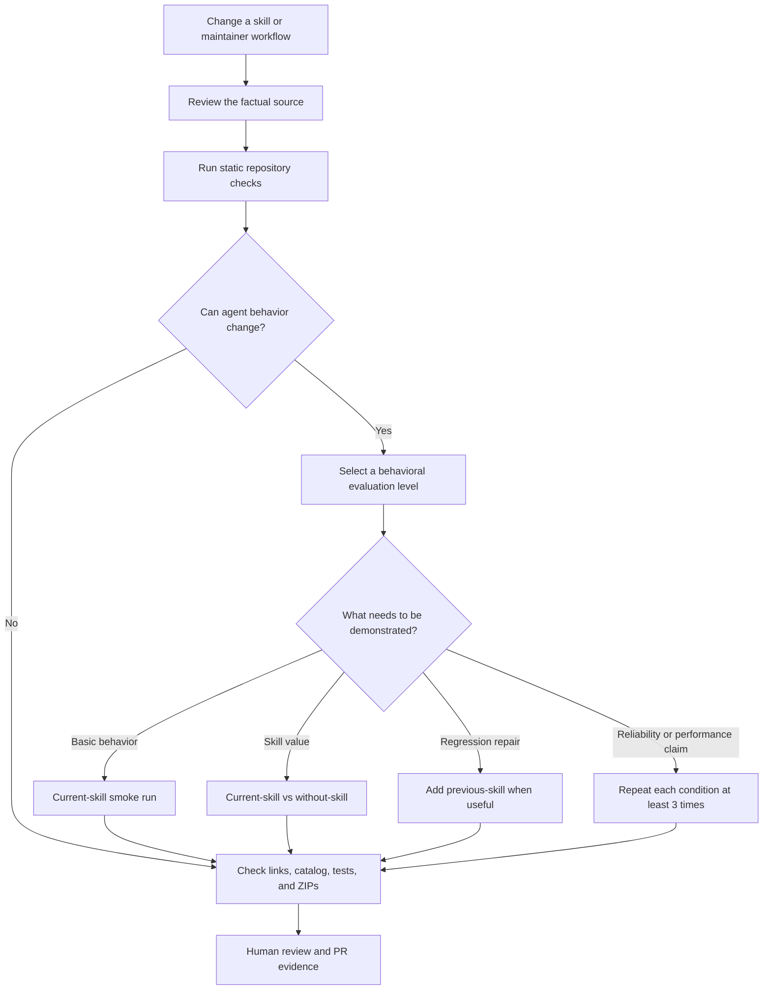
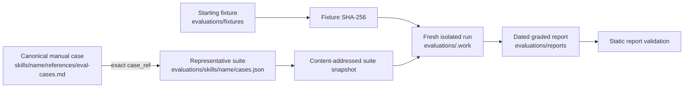

# Maintenance verification guide

This guide explains how verification works in this repository and how to
choose the right level for a change. It is written for maintainers and
reviewers who need to understand what each check proves, what evidence it
produces, and where to look when something fails.

The repository uses several verification layers because no single check can
answer every maintenance question. Schema validation can prove that a skill is
well formed, but it cannot prove that an agent will make the right decision.
A model comparison can show a behavioral difference, but it cannot prove that
the release ZIP contains the intended files. Each layer has a distinct job.

## The verification model

Every change starts with deterministic repository checks. Behavioral
evaluation is added only when the change can affect an agent's decisions.
Packaging checks come last because they verify the final distributable shape.



The question in the middle is intentionally about behavior, not file count.
A large wording cleanup may need no model run. A one-line change to a version
boundary, security rule, routing description, or migration decision usually
does.

## What each verification does

| Verification | How to run it | What it demonstrates | What it does not demonstrate |
|---|---|---|---|
| Source review | Inspect Meteor `v3-docs`, implementation, tests, release history, and package history as appropriate | Guidance is based on reproducible Meteor evidence, including introduction versions and compatibility boundaries | That the skill expresses the evidence clearly or changes agent behavior |
| Skill and audit validation | `pnpm run validate:skills` | Frontmatter, naming, metadata, body size, permitted files, and audit record requirements satisfy the repository contract | Links, catalog output, runtime behavior, or model decisions |
| Evaluation validation | `pnpm run validate:evaluations` | Suites, fixtures, snapshots, and reports conform to their schemas and cross-reference one another consistently | That a model run actually produced a good answer unless the report contains honestly graded real-run evidence |
| Composite validation | `pnpm run validate` | Both static validation layers pass together | Link health, generated catalog state, unit behavior, or ZIP contents |
| Link checking | `pnpm run check-links` | Relative links resolve and `Source:` footers point to valid Meteor `devel` documentation paths | That the cited source supports every claim or proves the feature's introduction version |
| Catalog checking | `pnpm run catalog:check` | Generated README skill and bundle sections match skill metadata and `bundles.json` | That a classification or bundle choice is conceptually correct |
| Toolchain tests | `pnpm test` | Repository scripts and validators behave as their automated tests specify | Agent behavior or the completeness of manual review |
| Behavioral evaluation | Follow `skill-behavior-evaluation` and run isolated agent conditions | The skill produces the expected observable decisions, response content, file changes, or commands for representative cases | General reliability from one repetition, full coverage of every manual case, or release packaging correctness |
| ZIP build and inspection | `pnpm run build:zips` and inspect changed archives | Published skills contain the intended runtime files and exclude maintainer-only evidence | That the contained guidance is factually or behaviorally correct |
| Human review | Review the diff, evidence, cases, reports, and changed ZIPs | The change is coherent, appropriately scoped, and understandable beyond what automated checks encode | A substitute for any deterministic check that can be run directly |

`pnpm run validate` is necessary for every change, but it is not shorthand for
the complete verification process. The local check sequence used before a PR
is:

```bash
pnpm install --frozen-lockfile
pnpm run validate
pnpm run check-links
pnpm run catalog:check
pnpm test
pnpm run build:zips
```

## When a model run is warranted

Run a behavioral evaluation when a change affects at least one of these:

- a new published skill;
- skill selection, description, routing boundary, or handoff behavior;
- a version-sensitive capability or compatibility fallback;
- a security, migration, or other high-risk decision;
- a scaffold whose generated files or commands are part of the outcome;
- a behavioral failure observed in a previous run;
- a claim about skill value, reliability, time, or token usage.

A model run is normally unnecessary for spelling, formatting, repaired links,
source refreshes that do not change guidance, or internal refactoring of a
deterministic script whose tests fully cover the behavior.

Use the smallest evaluation level that answers the maintenance question:

| Maintenance question | Minimum useful evidence |
|---|---|
| Does the changed skill still handle its central case? | One isolated `current-skill` smoke run |
| Does the skill add value over normal model knowledge? | Matched `current-skill` and `without-skill` runs |
| Did this edit repair a known regression? | Rerun the affected matched conditions; add `previous-skill` when the old revision is needed for direct comparison |
| Is the skill reliably better or faster? | At least three repetitions of every compared condition, with measurements recorded per run |
| Does the correct skill get selected? | Routing cases covering the primary skill, allowed secondary skills, forbidden neighbors, and expected handoff |

One repetition supports a behavioral observation only. It must not be
reported as a reliability, time, or token result.

## How behavioral evidence fits together

The evaluation files form an evidence chain. Each file exists to keep one part
of the comparison reviewable and reproducible.



### Canonical manual cases

`skills/<name>/references/eval-cases.md` is the complete human-readable case
inventory shipped with a skill. It covers more situations than are practical
to run in every maintenance comparison.

### Representative suites

`evaluations/skills/<name>/cases.json` selects a small, high-signal subset.
Every suite case points back to an exact manual heading through `case_ref`.
Assertions describe observable outcomes rather than preferred wording.

`evaluations/routing/cases.json` tests selection boundaries before a skill body
is loaded. It is separate because routing quality depends primarily on names
and descriptions, not the detailed instructions inside a selected skill.

### Fixtures and their digests

Workspace cases begin from small committed projects under
`evaluations/fixtures/`. The fixture digest proves that compared conditions
started from identical bytes. Advisory cases use the canonical empty-workspace
digest.

Generate or inspect a fixture digest with:

```bash
pnpm run evaluation:hash-fixture -- evaluations/fixtures/<skill>/<case>
```

### Suite snapshots

A report must reference the exact suite used during the run. Before executing
the model, create a content-addressed snapshot:

```bash
pnpm run evaluation:snapshot-suite -- evaluations/skills/<skill>/cases.json
```

The snapshot name is the SHA-256 of its contents. If the maintained suite
changes later, historical reports continue to point at the original immutable
assertions and prompts.

### Raw work and reports

Fresh workspaces, transcripts, event logs, and intermediate command output
belong under ignored `evaluations/.work/`. They help local diagnosis but are not
release content.

A dated JSON report under `evaluations/reports/` records the reproducible part
of completed runs: revisions, suite snapshot, fixture digest, client, model,
conditions, assertion outcomes, evidence, limitations, and classification.
Reports are immutable. A later run creates a new report rather than rewriting
an earlier result.

## Keeping comparisons fair

For a matched comparison, hold these inputs constant:

- prompt and assertion set;
- starting fixture and fixture digest;
- Meteor release and package context;
- client, model, reasoning settings, and accessible project files;
- repetition number.

Change only the skill condition. `current-skill` includes the maintained skill;
`without-skill` omits it. `previous-skill` includes one exact earlier revision.
Never reuse a workspace mutated by another condition.

Do not expose assertions, reviewer notes, expected solutions, or another
condition's output to the agent. Grade the final response, changed files, and
deterministic command results after the run.

## Interpreting a failed evaluation

A failed assertion does not automatically mean the skill is wrong. Diagnose
the failure before editing:

| Classification | Meaning | Appropriate response |
|---|---|---|
| `skill-gap` | The skill lacks, hides, or misroutes valid required guidance | Update the smallest relevant skill surface, bump its version when behavior changes, and rerun affected cases |
| `evaluation-gap` | The prompt or assertion does not represent the intended Meteor behavior | Repair the suite from authoritative evidence and rerun every affected condition |
| `harness-gap` | Isolation, installation, fixture setup, execution, or evidence capture failed | Repair the harness and discard the invalid run from capability claims |
| `no-gap` | Observable behavior satisfies the suite | Record the supported scope without expanding it into reliability claims |
| `inconclusive` | Available evidence cannot distinguish the cause | Narrow the case or collect stronger evidence before changing the skill |

Do not weaken an assertion merely to make a run pass. The recent
`EnvironmentVariable` maintenance case illustrates why this distinction
matters: checking current Meteor documentation showed that the evaluation had
encoded the wrapper boundary incorrectly. The right response was to correct
the case as an `evaluation-gap`, update the skill from the source of truth, and
preserve the older report as historical evidence.

## Common maintenance examples

### Documentation-only correction

A reference has a broken link, but its guidance and routing remain unchanged.
Run static validation, link checking, catalog checking, tests, and ZIP
inspection. A model run adds little evidence.

### Version-sensitive capability

A Meteor 3.5 feature is added to a skill that supports all Meteor 3 releases.
Verify the introduction version from release history or versioned source,
state the 3.0 through 3.4 fallback, add cases on both sides of the boundary,
and run the affected behavioral comparison.

### Routing change

A description is broadened to recognize a new request. Review neighboring
descriptions, update routing cases with positive and near-miss prompts, and
verify the primary, secondary, and forbidden skill outcomes.

### Observed regression

A real run misses an instruction that already exists in a long reference.
First confirm that the instruction is factually correct. Then improve its
salience in the skill entry point, preserve or strengthen the observable
assertion, and rerun only the affected matched conditions.

## Before opening or updating a PR

Confirm all of the following:

1. Factual claims point to the current Meteor revision and version-specific
   claims have an introduction source.
2. Every changed skill has the appropriate independent `metadata.version`.
3. Manual cases and representative suites reflect changed behavior.
4. Behavioral reports exist when the change requires them, and raw work stays
   under `evaluations/.work/`.
5. All deterministic checks pass.
6. Changed ZIPs contain only published skill runtime files. `.github/skills/`,
   `evaluations/`, audits, and raw artifacts must remain outside them.
7. The PR explains what was verified, which client and model were used, and
   what the evidence does not claim.

CI validates definitions and committed reports, but it does not invoke a
model. Human reviewers remain responsible for evaluating the quality of real
runs and for executing the complete canonical manual inventory required by
the repository review policy.

## Normative references

- [`AGENTS.md`](../AGENTS.md) defines the repository authoring contract.
- [`skill-maintenance`](../.github/skills/skill-maintenance/SKILL.md) defines
  the operational workflow for published skill changes.
- [`skill-behavior-evaluation`](../.github/skills/skill-behavior-evaluation/SKILL.md)
  defines when and how to execute model evaluations.
- [The evaluation contract](../.github/skills/skill-behavior-evaluation/references/evaluation-contract.md)
  defines suite, fixture, snapshot, and report invariants.
- [`CONTRIBUTING.md`](../CONTRIBUTING.md) contains the contributor entry path.
- [`RELEASING.md`](../RELEASING.md) contains the release checklist.
